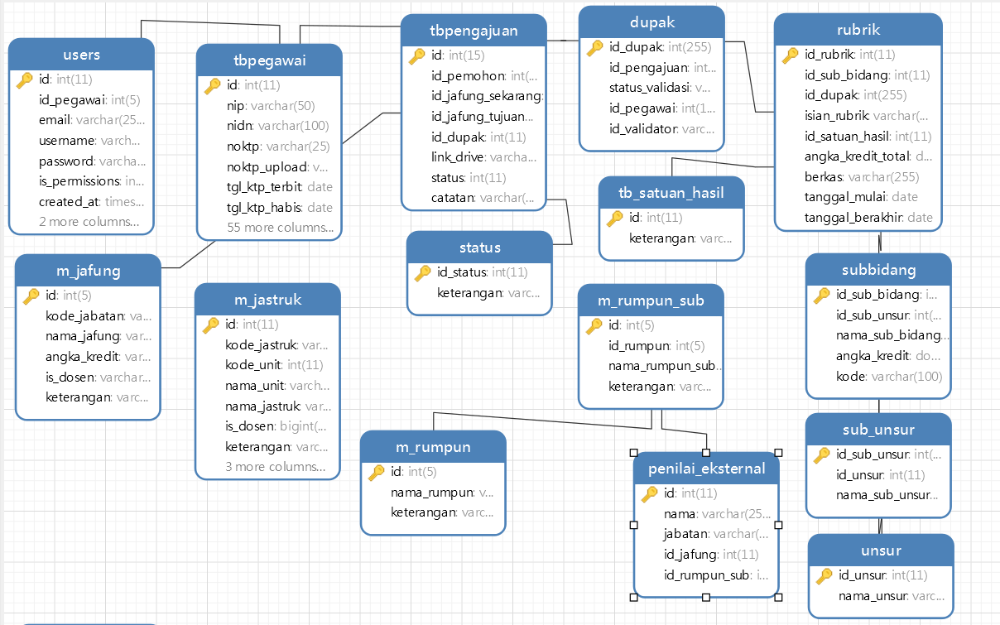

<p align="center"></p>

<p align="center">
<a href="https://travis-ci.org/laravel/framework"></a>
<a href="https://packagist.org/packages/laravel/framework"></a>
<a href="https://packagist.org/packages/laravel/framework"></a>
<a href="https://packagist.org/packages/laravel/framework"></a>
</p>

## Cara Install

Download ke local komputer kalian bisa pakai
```sh
$ git clone https://gitlab.com/arifrahman.fauzi/sistem-informasi-kenaikan-pangkat.git
```

- Buat Databasenya namanya terserah defaultnya nama databasenya [blog].
- eksport sqlnya ke database kalian.
- masuk ke folder projectnya.
- rename file `.env.example` ke `.env`.
- ketikan perintah ini :
```sh
$ composer install
$ php artisan:key generate
```
- `kalau file .env tidak ada kalian bisa copy dari project laravel lain kemudian di sesuaikan konfigurasinya sesuai punya kalian`


`Gambar Relasi Databasenya`




=======
- untuk login ada 3 jenis : `arif, admin, superadmin ` untuk Password `[123456]`
- `Gambar Relasi Databasenya`


>>>>>>> 13d653d7cc1137e35cb61b15908d071a46480ceb

## License

The Laravel framework is open-sourced software licensed under the [MIT license](https://opensource.org/licenses/MIT).
